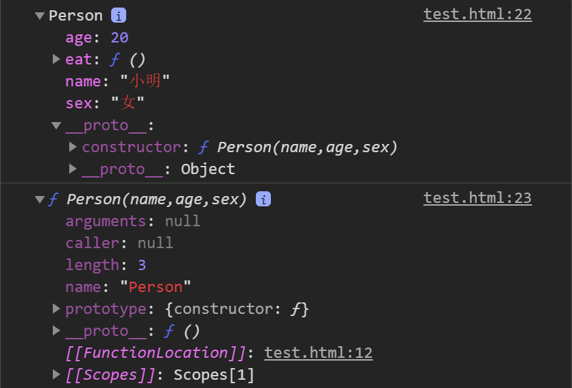
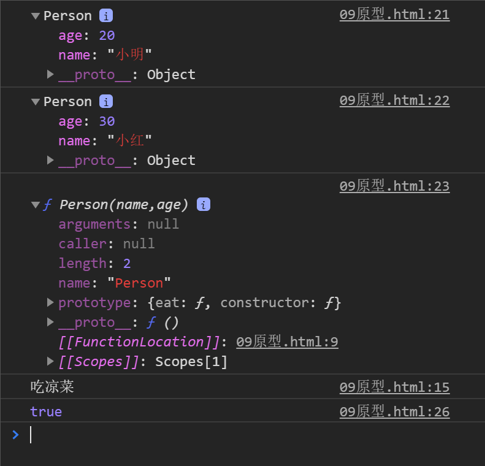
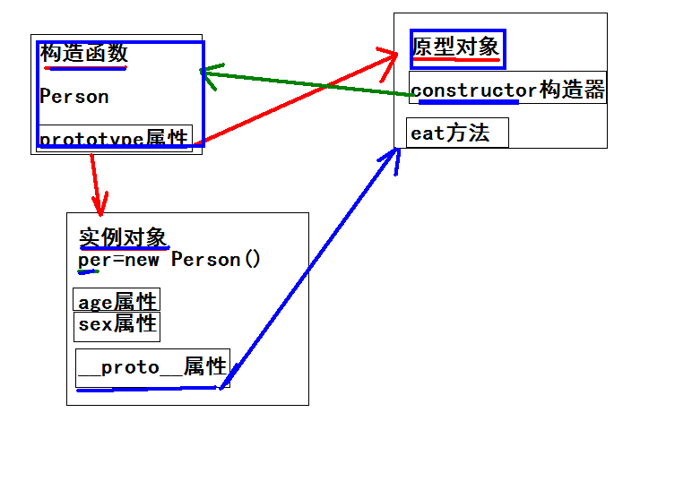

## JavaScript面向对象编程

### 什么是对象：

ECMAScript-262 把对象定义为：**无序属性的集合，其属性可以包含基本值、对象或者函数**。

严格来讲，这就相当于说对象是一组没有特定顺序的值。对象的每个属性或方法都有一个名字，而每个名字都映射到一个值。

> 提示：每个对象都是基于一个引用类型创建的，这些类型可以是系统内置的原生类型，也可以是开发人员自定义的类型。

### 什么是面向对象：

> 面向对象不是新的东西，它只是过程式代码的一种高度封装，目的在于提高代码的开发效率和可维护性。

### 面向对象与面向过程：

- 面向过程就是亲力亲为，事无巨细，面面俱到，步步紧跟，有条不紊

- 面向对象就是找一个对象，指挥得结果

- 面向对象将执行者转变成指挥者

- 面向对象不是面向过程的替代，而是面向过程的封装
- 面向过程注重过程，面向对象注重结果

### 面向对象的特性：

- 封装性
- 继承性
- 多态性

在 JavaScript 中，所有数据类型都可以视为对象，当然也可以自定义对象。

自定义的对象数据类型就是面向对象中的类（ Class ）的概念。

### 创建对象的方法：

- **new Object()**

  ```javascript
  var person = new Object()
  person.name = 'Jack'
  person.age = 18
  
  person.sayName = function () {
    console.log(this.name)
  }
  ```

  每次都new比较麻烦，所以可以通过简写形式即对象字面量来创建。

- **对象字面量方法**

  ```javascript
  var person = {
    name: 'Jack',
    age: 18,
    sayName: function () {
      console.log(this.name)
    }
  }
  ```

  对于上面的写法固然没有问题，但是假如我们要生成两个 `person` 实例对象呢？

  ```javascript
  var person1 = {
    name: 'Jack',
    age: 18,
    sayName: function () {
      console.log(this.name)
    }
  }
  
  var person2 = {
    name: 'Mike',
    age: 16,
    sayName: function () {
      console.log(this.name)
    }
  }
  ```

  通过上面的代码我们不难看出，这样写的代码太过冗余，重复性太高。

  

  **简单方式的改进：工厂函数**

  

  我们可以写一个函数，解决代码重复问题：

  ```javascript
  function createPerson (name, age) {
    return {
      name: name,
      age: age,
      sayName: function () {
        console.log(this.name)
      }
    }
  }
  ```

  然后生成实例对象：

  ```javascript
  var p1 = createPerson('Jack', 18)
  var p2 = createPerson('Mike', 18)
  ```

  这样封装确实爽多了，通过工厂模式我们解决了创建多个相似对象代码冗余的问题，

  但却没有解决对象识别的问题（即怎样知道一个对象的类型）。

  那么就有更优雅的工厂函数：构造函数。

  

- **自定义构造函数**

```javascript
function Person (name, age) {
  this.name = name
  this.age = age
  this.sayName = function () {
    console.log(this.name)
  }
}

var p1 = new Person('Jack', 18)
p1.sayName() // => Jack

var p2 = new Person('Mike', 23)
p2.sayName() // => Mike
```

在上面的示例中，`Person()` 函数取代了 `createPerson()` 函数，但是实现效果是一样的。


**工厂模式和自定义构造函数的相同点与不同点**


共同点:都是函数,都可以创建对象,都可以传入参数

不同点：

- 工厂模式:
  - 函数名是小写
  -  有new
  - 有返回值
  - new之后的对象是当前的对象
  - 直接调用函数就可以创建对象

- 自定义构造函数:
  - 函数名是大写(首字母)
  - 没有new
  - 没有返回值
  -  this是当前的对象
  - 通过new的方式来创建对象

> \- 没有显示的创建对象
>
> \- 直接将属性和方法赋给了 `this` 对象
>
> \- 没有 `return` 语句
>
> \- 函数名使用的是大写的 `Person`


**调用构造函数创建实例会经历以下 4 个步骤：**

1.  开辟空间存储对象

2. 把this设置为当前的对象

​    3. 设置属性和方法的值

    4. 把this对象返回


**构造函数和实例对象的关系**

使用构造函数的好处不仅仅在于代码的简洁性，更重要的是我们可以识别对象的具体类型了。

```javascript
function Person(name,age,sex) {
      this.name=name;
      this.age=age;
      this.sex=sex;
      this.eat=function () {
        console.log("吃肉肉");
      };
    }

    var girl=new Person("小明",20,"女");
     console.dir(girl);
     console.dir(Person);
```

控制台显示如下：



在每一个实例对象中的\__proto\__中同时有一个 `constructor` 属性,，该属性指向创建该实例的构造函数。

```javascript
console.log(girl.constructor==Person);//true

console.log(girl.__proto__.constructor==Person);
  console.log(girl.__proto__.constructor==Person.prototype.constructor);
  //console.log(girl instanceof Person);
```

以上控制台都打印true，代表这个实例对象girl就是通过Person来创建的。所以我们也可以用它来检测对象的类型。


**检测对象类型的方法**


- 通过构造器的方式 实例对象.构造器==构造函数名字

- 对象 instanceof 构造函数名字

​    \*  尽可能的使用第二种方式来识别,为什么?原型讲完再说


**总结**

- 构造函数是根据具体的事物抽象出来的抽象模板
- 实例对象是根据抽象的构造函数模板得到的具体实例对象
- 每一个实例对象都具有一个 `constructor` 属性，指向创建该实例的构造函数
  + 注意： `constructor` 是实例的属性的说法不严谨，具体后面的原型会讲到
- 可以通过实例的 `constructor` 属性判断实例和构造函数之间的关系
  + 注意：这种方式不严谨，推荐使用 `instanceof` 操作符，后面学原型会解释为什么
  
#### 构造函数的问题

使用构造函数带来的最大的好处就是创建对象更方便了，但是其本身也存在一个浪费内存的问题：

```javascript
function Person (name, age) {
  this.name = name
  this.age = age
  this.type = 'human'
  this.sayHello = function () {
    console.log('hello ' + this.name)
  }
}

var p1 = new Person('lpz', 18)
var p2 = new Person('Jack', 16)
```
在该示例中，从表面上好像没什么问题，但是实际上这样做，有一个很大的弊端。
那就是对于每一个实例对象，`type` 和 `sayHello` 都是一模一样的内容，
每一次生成一个实例，都必须为重复的内容，多占用一些内存，如果实例对象很多，会造成极大的内存浪费,创建100个对象就会产生100个sayHello方法。

```javascript
console.log(p1.sayHello === p2.sayHello) // => false
```
从上面的代码中可以看出这两个实例的sayHello方法不是一个方法。

对于这种问题我们可以把需要共享的函数定义到构造函数外部：

```javascript
function sayHello = function () {
  console.log('hello ' + this.name)
}

function Person (name, age) {
  this.name = name
  this.age = age
  this.type = 'human'
  this.sayHello = sayHello
}

var p1 = new Person('lpz', 18)
var p2 = new Person('Jack', 16)

console.log(p1.sayHello === p2.sayHello) // => true
```

这样确实可以了，但是新问题又来了：在全局作用域中定义的函数实际上只能被某个对象调用。更让人无法接受的是如果对象需要定义很多方法，那么就要定义很多个全局函数，这样没有封装性可言了。
以上问题都可以使用原型来解决。

### 原型

Javascript 规定，每一个构造函数都有一个 `prototype` 属性，指向另一个对象。
这个对象的所有属性和方法，都会被构造函数的实例继承。

这也就意味着，我们可以把所有对象实例需要共享的属性和方法直接定义在 `prototype` 对象上。

```javascript
 function Person(name,age) {
      this.name=name;
      this.age=age;
    }
    //通过原型来添加方法,解决数据共享,节省内存空间
    Person.prototype.eat=function () {
      console.log("吃凉菜");
    };

    var p1=new Person("小明",20);
    var p2=new Person("小红",30);
    console.log(p1.eat==p2.eat);//true

    console.dir(p1);
    console.dir(p2);

    //实例对象中根本没有eat方法,但是能够使用,因为实例继承了原型的方法
```
```javascript
    console.dir(p1);
    console.dir(p2);
    console.dir(Person);
    p1.__proto__.eat();

    console.log(p1.__proto__==Person.prototype);

```
控制台输出

说明了：
  - 实例对象中有__proto__这个属性,叫原型,也是一个对象,这个属性是给浏览器使用,不是标准的属性----->__proto__----->可以叫原型对象
  - 构造函数中有prototype这个属性,叫原型,也是一个对象,这个属性是给程序员使用,是标准的属性------>prototype--->可以叫原型对象
  
  - 实例对象的__proto__和构造函数中的prototype相等--->true
  - 又因为实例对象是通过构造函数来创建的,构造函数中有原型对象prototype
  - 实例对象的__proto__指向了构造函数的原型对象prototype
  - __proto__或者是prototype,都是原型对象。
  - 原型的作用:共享数据,节省内存空间

#### 构造函数、实例、原型三者之间的关系


实例中的__proto__指向原型对象prototype，原型对象中的constructor指向构造函数，构造函数中的prototype属性指向原型对象。


注意：任何函数都具有一个 `prototype` 属性，该属性是一个对象。
```javascript
function F () {}
console.log(F.prototype) // => object

F.prototype.sayHi = function () {
  console.log('hi!')
}
```

#### 利用原型共享数据

需要共享的数据放在原型里，这样节省内存，不共享的写在构造函数里。
```javascript
//什么样子的数据是需要写在原型中?
    //需要共享的数据就可以写原型中
    //原型的作用之一:数据共享

    //属性需要共享,方法也需要共享
    //不需要共享的数据写在构造函数中,需要共享的数据写在原型中
    //构造函数
    function Student(name,age,sex) {
      this.name=name;
      this.age=age;
      this.sex=sex;
    }
    //所有学生的身高都是188,所有人的体重都是55
    //所有学生都要每天写500行代码
    //所有学生每天都要吃一个10斤的西瓜
    //原型对象
    Student.prototype.height="188";
    Student.prototype.weight="55kg";
    Student.prototype.study=function () {
      console.log("学习,写500行代码,小菜一碟");
    };
    Student.prototype.eat=function () {
      console.log("吃一个10斤的西瓜");
    };
    //实例化对象,并初始化
    var stu=new Student("晨光",57,"女");
    console.dir(Student);
    console.dir(stu);
```
构造函数的 `prototype` 对象默认都有一个 `constructor` 属性，指向 `prototype` 对象所在函数。

```javascript
console.log(F.constructor === F) // => true
```

通过构造函数得到的实例对象内部会包含一个指向构造函数的 `prototype` 对象的指针 `__proto__`。

```javascript
var instance = new F()
console.log(instance.__proto__ === F.prototype) // => true
```
  实例对象的__proto__指向了构造函数的原型对象prototype，
   __proto__或者是prototype,都是原型对象。

- 实例对象可以直接访问原型对象成员（所有实例都直接或间接继承了原型对象的成员）。
- 也就是说即使实例没有定义某个方法，如果原型中有这个方法，那么实例就可以用这个方法。

#### 属性成员的搜索原则：原型链

了解了 **构造函数-实例-原型对象** 三者之间的关系后，接下来我们来解释一下为什么实例对象可以访问原型对象中的成员。
- 实例调用某个方法时，是先查看实例本身有没有这个方法如果有调用没有向上查找原型，原型有就调用原型也没有就返回undefined。

也就是说，在我们调用 `person1.sayName()` 的时候，会先后执行两次搜索：

- 首先，解析器会问：“实例 person1 有 sayName 属性吗？”答：“没有。
- ”然后，它继续搜索，再问：“ person1 的原型有 sayName 属性吗？”答：“有。
- ”于是，它就读取那个保存在原型对象中的函数。
- 当我们调用 person2.sayName() 时，将会重现相同的搜索过程，得到相同的结果。

而这正是多个对象实例共享原型所保存的属性和方法的基本原理。

总结：

- 先在自己身上找，找到即返回
- 自己身上找不到，则沿着原型链向上查找，找到即返回
- 如果一直到原型链的末端还没有找到，则返回 `undefined`

#### 更简单的原型语法

我们注意到，前面例子中每添加一个属性和方法就要敲一遍 `Person.prototype` 。
为减少不必要的输入，更常见的做法是用一个包含所有属性和方法的对象字面量来重写整个原型对象：

```javascript
function Person (name, age) {
  this.name = name
  this.age = age
}

Person.prototype = {
  type: 'human',
  sayHello: function () {
    console.log('我叫' + this.name + '，我今年' + this.age + '岁了')
  }
}
```

在该示例中，我们将 `Person.prototype` 重置到了一个新的对象。
这样做的好处就是为 `Person.prototype` 添加成员简单了，但是也会带来一个问题，那就是原型对象丢失了 `constructor` 成员。

所以，我们为了保持 `constructor` 的指向正确，我们需要手动添加constructor。
```javascript
function Person (name, age) {
  this.name = name
  this.age = age
}

Person.prototype = {
  constructor: Person, // => 手动将 constructor 指向正确的构造函数
  type: 'human',
  sayHello: function () {
    console.log('我叫' + this.name + '，我今年' + this.age + '岁了')
  }
}
```
#### 原型对象使用建议

- 私有成员（一般就是非函数成员）放到构造函数中
- 共享成员（一般就是函数）放到原型对象中
- 如果重置了 `prototype` 记得修正 `constructor` 的指向