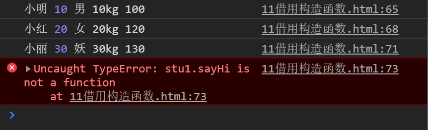

## 原型链及继承

### 复习面向对象及原型

#### 面向对象？

- 面向过程和面向对象都是编程的思想,方式不一样
- 面向过程:凡事都是亲力亲为,所有的代码都要自己写,每一步都要很清楚,注重的是过程
- 面向对象:执行者成为指挥者,只要找对象,然后让对象做相关的事情,注重的是结果
- 面向对象的特性:封装,继承,多态
- 封装；就是代码的封装,把一些特征和行为封装在对象中.
- 面向对象的编程思想:根据需求,抽象出相关的对象,总结对象的特征和行为,把特征变成属性，行为变成方法,然后定义(js)构造函数,实例化对象,通过对象调用属性和方法,完成相应的需求.---编程的思想
- 对象:具体特指的某个事物,有特征(属性)和行为(方法)

#### 如何创建对象?

通过调用new Object(),还有{},自定义构造函数

创建对象的方式：
1. 调用系统Object()----->每次都要new麻烦，创建出来的对象都是Object类型的,不能很明确的指出这个对象是属于什么类型
2. 字面量的方式{}----->只能创建一个对象(一次只能创建一个)，要创建多个有相同属性的对象就会造成代码冗余，重复性高
3. 工厂模式创建对象----->没有解决对象类型识别问题----->推论---->自定义构造函数的方式
   - 自定义构造函数(优化后的工厂模式)
   - 自定义构造函数创建对象:4件事
       -  在内存中申请一块空闲的空间,存储创建的对象
       -  this就是当前实例化的对象
       -  设置对象中的属性和方法(为对象添加属性和方法,为属性和方法赋值)
       -  把创建后的对象返回

#### 什么是原型？

- 构造函数中有一个属性prototype,是原型,程序员使用的
- 实例对象中有一个属性__proto__,是原型,浏览器使用的,不是很标准的
- 实例对象中的__proto__指向的就是该实例对象中的构造函数中的prototype
- 构造函数中的prototype里面的属性或者方法,可以直接通过实例对象调用
- 正常的写法:实例对象.__proto__才能访问到构造函数中的prototype中的属性或者方法
- per.__proto__.eat();//__proto__不是标准的属性
- per.eat();
- 原型就是属性,而这个属性也是一个对象
- Person.prototype--->是属性
-  Person.prototype.属性或者Person.ptototype.方法()--->是对象
-  本身在构造函数中定义的属性和方法,当实例化对象的时候,实例对象中的属性和方法都是在自己的空间中存在的,如果是多个对象。这些属性和方法都会在单独的空间中存在,浪费内存空间,所以,为了数据共享,把想要节省空间的属性或者方法写在原型对象中,达到了数据共享，实现了节点内存空间
-  原型的作用之一:数据共享,节省内存空间
-   原型的写法:
    - 构造函数.prototype.属性=值
    - 构造函数.prototype.方法=值---->函数.prototype,函数也是对象,所以,里面也有__proto__
    - 实例对象.prototype-------->实例对象中没有这个属性,只有__proto__(暂时的)
- 简单的原型的写法
   -  缺陷:--->新的知识点---->原型直接指向{}---->就是一个对象,没有构造器
   -  构造函数.prototype={
      切记:如果这这种写法,要把构造器加上
      };
- 通过原型为内置对象添加原型的属性或者方法----->原因:
   -  系统的内置对象的属性和方法可能不满足现在需求,所以,可以通过原型的方式加入属性或者方法,为了方便开发
    ```javascript
     String.prototype.方法=匿名函数;
      var str="哈哈";
      str.方法();//实例对象可以直接调用原型中的属性或者方法
     
     ```
### 原型及原型链

- 实例对象的原型__proto__和构造函数的原型prototype指向是相同的
- 实例对象中的__proto__原型指向的是构造函数中的原型prototype
- 原型链:是一种关系,实例对象和原型对象之间的关系,关系是通过原型(__proto__)来联系的

```javascript
 console.log(per.__proto__==Person.prototype);//true
```


### 原型的指向是否可以改变

先看下面的代码：
```javascript
   function Person(age) {
     this.age=age;
     console.log(this);
   }
   Person.prototype.eat=function () {
     console.log(this);
     console.log("您吃了没,走着,吃点臭豆腐去");
   };
   console.log("打印构造函数的this")
   var per=new Person(10);
   console.log("打印原型中的this")
   per.eat();
   console.log("打印per对象")
   console.log(per);

```
**运行结果为：**

**说明：**
- 构造函数中的this就是实例对象（this指向调用构造函数的那个对象就是实例对象）
- 原型对象中方法中的this就是实例对象（同上）

我们再定义一个student构造函数：
```javascript
   function Student() {

   }
   Student.prototype.study=function () {
     console.log("就是天天学习,学习如何做人,如何敲代码,如何成为人");
   };
   Student.prototype={
     eat:function () {
       console.log("哈哈,好吃的榴莲酥");
     }
   };

   var stu=new Student();

   stu.eat();
```

既然人也有吃的方法，学生也有吃的方法，那么能不能让学生继承人的吃方法呢，这样就不用再在学生的原型对象中添加eat方法了。答案是可以的。
```javascript
//人的构造函数
    function Person(age) {
      this.age=10;
    }
    //人的原型对象方法
    Person.prototype.eat=function () {
      console.log("人的吃");
    };
    //学生的构造函数
    function Student() {

    }
    Student.prototype.sayHi=function () {
      console.log("嗨,小苏你好帅哦");
    };
    //学生的原型,指向了一个人的实例对象
    Student.prototype=new Person(10);

    var stu=new Student();
    stu.eat();//就能使用人的方法了
    stu.sayHi();
```
通过以上代码我们可以得出结论：
- 原型指向可以改变
- 实例对象的原型__proto__指向的是该对象所在的构造函数的原型对象
- 构造函数的原型对象(prototype)指向如果改变了,实例对象的原型(__proto__)指向也会发生改变
- 实例对象和原型对象之间的关系是通过__proto__原型来联系起来的,这个关系就是原型链
  
  

### 原型链最终指向了哪里

```javascript
function Person() {

    }
    Person.prototype.eat=function () {
      console.log("吃东西");
    };

    var per=new Person();
    console.dir(per);//Person{}
    console.dir(Person);//Function:Person    
```
- 实例对象中有__proto__原型
- 构造函数中有prototype原型
- prototype是对象

```javascript
console.log(Person.prototype.__proto__);//{}
console.log(Person.prototype.__proto__==Object.prototype);
//true
```
- 所以,prototype这个对象中也有__proto__,指向Object
- 实例对象中的__proto__指向的是构造函数的prototype，所以,prototype这个对象中__proto__指向的应该是某个构造函数的原型prototype

```javascript
console.log(per.__proto__==Person.prototype);//true
    console.log(per.__proto__.__proto__==Person.prototype.__proto__);//true
    
    console.log(Object.prototype.__proto__);//null
```
- per实例对象的__proto__指向Person.prototype
- Person.prototype的__proto__指向Object.prototype
- Object.prototype的__proto__是null

### 原型指向改变如何添加方法和访问

```javascript
   //人的构造函数
       function Person(age) {
         this.age=age;
       }
       //人的原型中添加方法
       Person.prototype.eat=function () {
         console.log("人正在吃东西");
       };
       //学生构造函数
       function Student(sex) {
         this.sex=sex;
       }
    
       //学生的原型中添加方法----先在原型中添加方法
       Student.prototype.sayHi=function () {
         console.log("您好哦");
       };
       //改变了原型对象的指向
       Student.prototype=new Person(10);
    
       var stu=new Student("男");
       stu.eat();
       stu.sayHi();
    
```
以上代码是在student原型指向改变前添加方法，改变后调用方法，结果将报错，显示sayHi不是一个方法。

```javascript
   //人的构造函数
       function Person(age) {
         this.age=age;
       }
       //人的原型中添加方法
       Person.prototype.eat=function () {
         console.log("人正在吃东西");
       };
       //学生构造函数
       function Student(sex) {
         this.sex=sex;
       }
    
       //改变了原型对象的指向
       Student.prototype=new Person(10);
       //学生的原型中添加方法----先在原型中添加方法
       Student.prototype.sayHi=function () {
         console.log("您好哦");
       };
       var stu=new Student("男");
       stu.eat();
       stu.sayHi();
    
       console.dir(stu);

```
以上代码时再学生原型改变后再向原型添加方法，所以输出结果正常。
- 如果原型指向改变了,那么就应该在原型改变指向之后添加原型方法。

### 实例对象的属性和原型对象中的属性重名问题

#### 实例对象和原型对象有相同属性但是值不同，那么实例对象的属性采用哪个？

```javascript
function Person(age,sex) {
  this.age=age;
  this.sex=sex;
}
Person.prototype.sex="女";
var per=new Person(10,"男");
console.log(per.sex);
```
这段代码的打印结果是男(因为实例中有性别这个属性，所以直接使用实例中定义的)

```javascript
function Person(age) {
  this.age=age;
}
Person.prototype.sex="女";
var per=new Person(10,"男");
console.log(per.sex);
```
这段代码的打印结果是女（因为构造函数中没有性别这个属性，实例中的男不起作用，实例也就没有性别这个属性，所以去原型中找，原型里面性别为女，所以结果是女）

#### 实例对象能不能改变原型对象中的属性？

```javascript
function Person(age) {
  this.age=age;
  
}
Person.prototype.sex="女";//原型中性别为女
var per=new Person(10,"男");
per.sex="人";//企图使用实例对象改变原型的属性
   console.log(per.sex);

   console.dir(per);//per里面的__Proto__里面的性别依旧为女，企图失败
```
打印结果如下图：

实例对象不能改变原型对象的属性。

```javascript
console.log(per.fdsfdsfsdfds);
```
输出undefined
**得出结论：**
- 实例对象访问这个属性,应该先从实例对象中找,找到了就直接用，找不到就去指向的原型对象中找,找到了就使用,找不到呢返回undefined。
- 通过实例对象能否改变原型对象中的属性值?不能
- 就想改变原型对象中属性的值,怎么办?直接通过原型对象.属性=值;(Person.prototype.sex=...)可以改变
- 因为JS是一门动态类型的语言,对象没有什么,只要点了,那么这个对象就有了这个东西,没有这个属性,只要对象.属性名字,对象就有这个属性了,但是,该属性没有赋值,所以,结果是:undefined

### 一个很神奇的原型链

```html
<body>
<div id="dv"></div>
<script>
  var divObj=document.getElementById("dv");
  console.dir(divObj);

  //divObj.__proto__---->HTMLDivElement.prototype的__proto__--->HTMLElement.prototype的__proto__---->Element.prototype的__proto__---->Node.prototype的__proto__---->EventTarget.prototype的__proto__---->Object.prototype没有__proto__,所以,Object.prototype中的__proto__是null

</script>
</body>
```
### 继承

js中的继承也是为了实现数据共享
原型作用之一:数据共享,节省内存空间
原型作用之二:为了实现继承

#### js中通过原型来实现继承

```javascript
 function Person(name,age,sex) {
      this.name=name;
      this.sex=sex;
      this.age=age;
    }
    Person.prototype.eat=function () {
      console.log("人可以吃东西");
    };
    Person.prototype.sleep=function () {
      console.log("人在睡觉");
    };
    Person.prototype.play=function () {
      console.log("生活就是不一样的玩法而已");
    };


    function Student(score) {
      this.score=score;
    }
    //改变学生的原型的指向即可==========>学生和人已经发生关系
    Student.prototype=new Person("小明",10,"男");
    Student.prototype.study=function () {
      console.log("学习很累很累的哦.");
    };

    //相同的代码太多,造成了代码的冗余(重复的代码)

    var stu=new Student(100);
    console.log(stu.name);
    console.log(stu.age);
    console.log(stu.sex);
    stu.eat();
    stu.play();
    stu.sleep();
    console.log("下面的是学生对象中自己有的");
    console.log(stu.score);
    stu.study();

```
改变学生的原型指向，使原型指向Person就可以继承Person的属性
```javascript
function Person(name,age,sex,weight) {
         this.name=name;
         this.age=age;
         this.sex=sex;
         this.weight=weight;
       }
       Person.prototype.sayHi=function () {
         console.log("您好");
       };
       function Student(score) {
         this.score=score;
       }
       //希望人的类别中的数据可以共享给学生---继承
       Student.prototype=new Person("小明",10,"男","50kg");
    
       var stu1=new Student("100");
       console.log(stu1.name,stu1.age,stu1.sex,stu1.weight,stu1.score);
       stu1.sayHi();
    
       var stu2=new Student("120");
       console.log(stu2.name,stu2.age,stu2.sex,stu2.weight,stu2.score);
       stu2.sayHi();

       var stu3=new Student("130");
       console.log(stu3.name,stu3.age,stu3.sex,stu3.weight,stu3.score);
       stu3.sayHi();
```

可以看出这三个学生的实例对象通过继承人的属性，除了自己的属性分数不一样其他的性别年龄名字体重还有方法都一样。
- 为了数据共享,改变原型指向,做到了继承---通过改变原型指向实现的继承
- 缺陷:因为改变原型指向的同时实现继承,直接初始化了属性，继承过来的属性的值都是一样的了,所以,这就是问题
- 只能重新调用对象的属性进行重新赋值。

解决方案:继承的时候,不用改变原型的指向,直接调用父级的构造函数的方式来为属性赋值就可以了------借用构造函数:把要继承的父级的构造函数拿过来,使用一下就可以了：

#### js借用构造函数实现继承

```javascript
function Person(name, age, sex, weight) {
  this.name = name;
  this.age = age;
  this.sex = sex;
  this.weight = weight;
}
Person.prototype.sayHi = function () {
  console.log("您好");
};
function Student(name,age,sex,weight,score) {
  //借用构造函数
  Person.call(this,name,age,sex,weight);
  this.score = score;
}
var stu1 = new Student("小明",10,"男","10kg","100");
console.log(stu1.name, stu1.age, stu1.sex, stu1.weight, stu1.score);

var stu2 = new Student("小红",20,"女","20kg","120");
console.log(stu2.name, stu2.age, stu2.sex, stu2.weight, stu2.score);

var stu3 = new Student("小丽",30,"妖","30kg","130");
console.log(stu3.name, stu3.age, stu3.sex, stu3.weight, stu3.score);
```


借用构造函数:构造函数名字.call(当前对象,属性,属性,属性....);
- 解决了属性继承,并且值不重复的问题
- 缺陷:父级类别中的方法不能继承

#### 组合继承

> 原型实现继承
> 借用构造函数实现继承
> 组合继承:原型继承+借用构造函数继承

```javascript
function Person(name,age,sex) {
      this.name=name;
      this.age=age;
      this.sex=sex;
    }
    Person.prototype.sayHi=function () {
      console.log("阿涅哈斯诶呦");
    };

    function Student(name,age,sex,score) {
      //借用构造函数:属性值重复的问题
      Person.call(this,name,age,sex);
      this.score=score;
    }

    //改变原型指向----继承
    Student.prototype=new Person();//不传值
    Student.prototype.eat=function () {
      console.log("吃东西");
    };

    var stu=new Student("小黑",20,"男","100分");
    console.log(stu.name,stu.age,stu.sex,stu.score);
    stu.sayHi();
    stu.eat();
    var stu2=new Student("小黑黑",200,"男人","1010分");
    console.log(stu2.name,stu2.age,stu2.sex,stu2.score);
    stu2.sayHi();
    stu2.eat();
```

属性和方法都被继承了

#### 拷贝继承

把一个对象中的属性或者方法直接复制到另一个对象中

```javascript
   var obj1={
     name:"小糊涂",
     age:20,
     sleep:function () {
      console.log("睡觉了");
     }
   };

   //改变了地址的指向
   var obj2=obj1;
   console.log(obj2.name,obj2.age);//小糊涂 20
   obj2.sleep();//睡觉了
```
或者：
```javascript
   var obj1={
     name:"小糊涂",
     age:20,
     sleep:function () {
       console.log("睡觉了");
     }
   };


   var obj2={};
   for(var key in obj1){
     obj2[key]=obj1[key];
   }
   console.log(obj2.name);//小糊涂
```
### 总结继承

- 面向对象特性:封装,继承,多态
- 继承,类与类之间的关系,面向对象的语言的继承是为了多态服务的
- js不是面向对象的语言,但是可以模拟面向对象.模拟继承.为了节省内存空间
- 继承:
   -  原型作用: 数据共享 ，目的是:为了节省内存空间,
   -  原型作用: 继承  目的是:为了节省内存空间
   -  原型继承:改变原型的指向
   -  借用构造函数继承:主要解决属性无法继承的问题
   -  组合继承:原型继承+借用构造函数继承，既能解决属性问题,又能解决方法问题
   -  拷贝继承:就是把对象中需要共享的属性或者方法,直接遍历的方式复制到另一个对象中