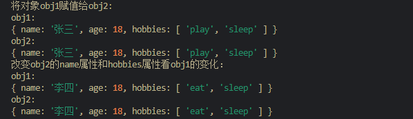
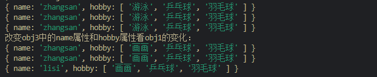
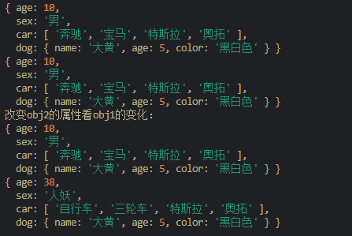
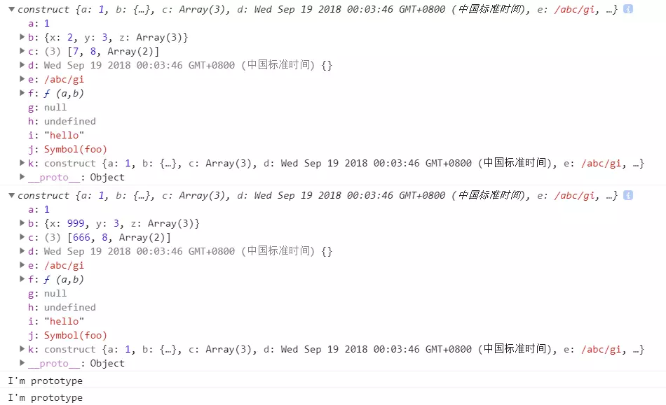

# 浅拷贝与深拷贝

## 前言

你可能会经常遇到操作数组、对象的情况，然后你肯定会将原数组、对象进行‘备份’
当真正对其操作时发现备份的也发生改变，此时你一脸懵逼，到时是为啥，不是已经备份了么，怎么备份的数组、对象也会发生变化。那么你就需要了解一下浅拷贝和深拷贝。

## 数据类型

- ECMAScript变量包含两种不同数据类型的值：`基本数据类型`和`引用数据类型`。
   1. 基本数据类型的特点：直接存储在栈（stack）中的数据(名值存储在栈内存中)。（闭包中的变量保存在堆中如果保存在栈中无法实现数据缓存）
   2. 引用数据类型的特点：存储的是该对象在栈中引用，真实的数据放在堆内存里(名存在栈内存中，值存在于堆内存中，但是栈内存会提供一个引用的地址指向堆内存中的值。)。当访问引用类型的时候，要先从栈中取出该对象的地址指针，然后再从堆内存中取得所需的数据。
    
- 目前基本数据类型有：`Boolean、Null、Undefined、Number、String、Symbol`，引用数据类型有：`Object、Array、Function、RegExp、Date`等.
- **深拷贝和浅拷贝是只针对object和Array这样的引用数据类型的。**

   

## 浅拷贝与深拷贝

深拷贝和浅拷贝的示意图大致如下：


**浅拷贝只复制指向某个对象的指针，而不复制对象本身，新旧对象还是共享同一块内存。但深拷贝会另外创造一个一模一样的对象，新对象跟原对象不共享内存，修改新对象不会改到原对象。**

## 赋值和浅拷贝的区别

关于这个问题我刚开始有点犯糊涂看了一些博客把我整迷糊了，于是我直接敲就明白他们的意思了。我们先看下面的代码：
```javascript
var a="hello";
var b=a;
console.log(a);//hello
console.log(b);//hello

b="world";
console.log(a);//hello
console.log(b);//world
```

```javascript
var obj1={
  name:'张三',
  age:18,
  hobbies:['play','sleep']
};
var obj2=obj1;
console.log("将对象obj1赋值给obj2:")
console.log("obj1:    ");
console.log(obj1);
console.log("obj2:    ");
console.log(obj2);

console.log("改变obj2的name属性和hobbies属性看obj1的变化：")
obj2.name='李四';
obj2.hobbies[0]='eat';
console.log("obj1:    ");
console.log(obj1);
console.log("obj2:    ");
console.log(obj2);

```



由此我们得出结论：

赋值是将**某一数值**或**对象**赋给某个变量的过程，分为下面 2 部分：

- 基本数据类型：赋值，赋值之后两个变量互不影响，就像第一份代码a赋值给b后，b的改变不影响a。
- 引用数据类型：赋址，两个变量具有相同的引用，指向同一个对象，相互之间有影响。在第二份代码中obj1赋值给了obj2，这样无论是改变对象里的**基本数据类型的属性**name还是改变**引用数据类型的属性**hobbies，原来的对象都会受到影响（哪怕只是对象obj1中的基本数据类型都受到了影响，这里不要和上一条搞混了）。

赋值的结果我们知道了那么和浅拷贝的区别是什么呢？看下面的代码：

```javascript
let obj1 = {
  name: "zhangsan",
  hobby: ["游泳","乒乓球","羽毛球"]
};
let obj2 = obj1;//赋值得到的obj2
//浅拷贝函数
function shallowCopy (sourceObj) {
  let result = {};
  for (let v in sourceObj) {
    if (sourceObj.hasOwnProperty(v)) {
      result[v] = sourceObj[v];
    } 
  }
  return result;
}
let obj3 = shallowCopy(obj1);//浅拷贝得到的obj3

console.log(obj1)
console.log(obj2)
console.log(obj3)
console.log("改变obj3中的name属性和hobby属性看obj1的变化：")
obj3.name="lisi";
obj3.hobby[0]='画画';
console.log(obj1)
console.log(obj2)
console.log(obj3)
```



由此我们得出结论：

- 浅拷贝得到的对象改变基本数据类型的属性的值原对象的基本数据类型的属性不变，但是改变引用类型的属性的值原对象就会跟着改变。就像代码中obj3的name和hobby发生了改变，obj1的name不变但是hobby跟着变了，又由于obj2是赋值得来的，它的所有属性都跟着obj1变化。
- 这就是浅拷贝浅的含义，**浅拷贝只复制一层对象的属性**，并**不包括**对象里面的为**引用类型的数据**。

## 深拷贝与浅拷贝的区别

根据上面的总结其实我们能推断出来深拷贝的特点就是拷贝后的对象无论哪种属性改变都不会影响原对象，我们写代码进行验证，结果也确实是这样。
```javascript
var obj1={
  age:10,
  sex:"男",
  car:["奔驰","宝马","特斯拉","奥拓"],
  dog:{
    name:"大黄",
    age:5,
    color:"黑白色"
  }
};

 var obj2={};//空对象
//通过函数实现,把对象a中的所有的数据深拷贝到对象b中
function deepCopy(a,b) {
  for(var key in a){
    //先获取a对象中每个属性的值
    var item=a[key];
    //判断这个属性的值是不是数组
    if(item instanceof Array){
      //如果是数组,那么在b对象中添加一个新的属性,并且这个属性值也是数组
      b[key]=[];
      //调用这个方法，把a对象中这个数组的属性值一个一个的复制到b对象的这个数组属性中
      deepCopy(item,b[key]);
    }else if(item instanceof Object){//判断这个值是不是对象类型的
 //如果是对象类型的,那么在b对象中添加一个属性,是一个空对象
      b[key]={};
      //再次调用这个函数,把a对象中的属性对象的值一个一个的复制到b对象的这个属性对象中
      deepCopy(item,b[key]);
    }else{
      //如果值是普通的数据,直接复制到b对象的这个属性中
      b[key]=item;
    }
  }
}

deepCopy(obj1,obj2);
console.dir(obj1);
console.dir(obj2);
console.log("改变obj2的属性看obj1的变化：");
obj2.age=38;
obj2.sex="人妖";
obj2.car[0]="自行车";
obj2.car[1]="三轮车";
console.dir(obj1);
console.dir(obj2);
```



总结：

- 首先，浅拷贝和深拷贝都只针对于像Object， Array这样的复杂对象。
- 深拷贝:拷贝还是复制,深:把一个对象中所有的属性或者方法,一个一个的找到.并且在另一个对象中开辟相应的空间,一个一个的存储到另一个对象中。
- 深拷贝的魔力，两个对象互不影响。
- 深拷贝比浅拷贝深一层就是深的那个引用类型。
- 浅拷贝只复制对象的第一层属性、深拷贝可以对对象的属性进行递归复制，深拷贝是对对象以及对象的所有子对象进行拷贝。

## 浅拷贝的实现方式

数组的concat、slice/Array.from()，对象的assign拷贝

1. Object.assgin()

Object.assign是ES6的新函数,Object.assgin()方法可以把任意多个的原对象自身的可枚举属性拷贝给目标对象，然后返回目标对象。但是Object.assgin()进行的是浅拷贝，拷贝的是对象的属性的引用，而不是对象本身。

```javascript
var obj1 = { 
  a: 
    {
      a: "kobe",
      b: 39
    },
  c:23
  };
var Obj2 = Object.assign({}, obj1);
Obj2.a.a = "wade";
Obj2.c=999;
console.log(obj1); //{a:{a:'wade",b:39},c:23}
console.log(Obj2);//{a:{a:'wade',b:39},c:999}
```

**注意：当object只有一层的时候，是深拷贝。**

```javascript
let obj = {
    username: 'kobe'
    };
let obj2 = Object.assign({},obj);
obj2.username = 'wade';
console.log(obj);//{username: "kobe"}
```

2.Array.prototype.concat()

```javascript
let arr = [1, 3, {
  username: 'kobe'
  }];
let arr2=arr.concat();
arr2[1]=333;
arr2[2].username = 'wade';
console.log(arr); //[1,3,{username:'wade'}]
console.log(arr2)//[1,333,{username:'wade'}]
```

3. Array.prototype.slice()

```javascript
let arr = [1, 3, {
    username: ' kobe'
    }];
let arr3 = arr.slice();
arr3[2].username = 'wade'
console.log(arr);//[1,3,{username:'wade'}]
```

总结：

- Array的slice和concat方法不修改原数组，只会返回一个浅复制了原数组中的元素的一个新数组。
- slice和concat实现的浅复制都是只能复制一维的数组。
- 换句话说slice、concat、assign只能深拷贝第一层使得拷贝后的对象改变第一层属性不影响原对象。

## 深拷贝的实现方式

1. JSON.parse(JSON.stringify(obj))：可实现多维对象的深拷贝，但会忽略`undefined、任意的函数、symbol` 值。

```javascript

var obj1 = {
    x: 1, 
    y: {
        m: 1
    },
    a:undefined,
    b:function(a,b){
      return a+b
    },
    c:Symbol("foo")
};
var obj2 = JSON.parse(JSON.stringify(obj1));
console.log(obj1) //{x: 1, y: {m: 1}, a: undefined, b: ƒ, c: Symbol(foo)}
console.log(obj2) //{x: 1, y: {m: 1}}
obj2.y.m = 2; //修改obj2.y.m
console.log(obj1) //{x: 1, y: {m: 1}, a: undefined, b: ƒ, c: Symbol(foo)}
console.log(obj2) //{x: 2, y: {m: 2}}
```

注：进行JSON.stringify()序列化的过程中，undefined、任意的函数以及 symbol 值，在序列化过程中会被忽略（出现在非数组对象的属性值中时）或者被转换成 null（出现在数组中时）。

由上面可知，JS 提供的自有方法并不能彻底解决Array、Object的深拷贝问题，因此我们应该自己实现。

## 深拷贝函数简单写法（递归实现）

```javascript
function deepClone(obj){
  let result = Array.isArray(obj)?[]:{};
  if(obj && typeof obj === "object"){
    for(let key in obj){
      if(obj.hasOwnProperty(key)){
        if(obj[key] && typeof obj[key] === "object"){
          result[key] = deepClone(obj[key]);
        }else{
          result[key] = obj[key];
        }
      }
    }
  }
  return result;
}

// 测试用
var obj1 = {
    x: {
        m: 1
    },
    y: undefined,
    z: function add(z1, z2) {
        return z1 + z2
    },
    a: Symbol("foo"),
    b: [1,2,3,4,5],
    c: null
};
var obj2 = deepClone(obj1);
obj2.x.m = 2;
obj2.b[0] = 2;
console.log(obj1);
console.log(obj2);
```


但上面的深拷贝方法遇到循环引用，会陷入一个循环的递归过程，从而导致爆栈。如：

```javascript
var obj1 = {
    x: 1, 
    y: 2
};
obj1.z = obj1;
var obj2 = deepClone(obj1);
```

因此需要改进。

## 深拷贝函数改进（防止循环递归）

解决因循环递归而暴栈的问题，只需要判断一个对象的字段是否引用了这个对象或这个对象的任意父级即可。

```javascript
function deepClone(obj, parent = null){ // 改进（1）
  let result = Array.isArray(obj)?[]:{};
  let _parent = parent;  // 改进（2）
  while(_parent){ // 改进（3）
    if(_parent.originalParent === obj){
      return _parent.currentParent;
    }
    _parent = _parent.parent;
  }
  if(obj && typeof obj === "object"){
    for(let key in obj){
      if(obj.hasOwnProperty(key)){
        if(obj[key] && typeof obj[key] === "object"){
          result[key] = deepClone(obj[key],{ // 改进（4）
            originalParent: obj,
            currentParent: result,
            parent: parent
          });
        }else{
          result[key] = obj[key];
        }
      }
    }
  }
  return result;
}

// 调试用
var obj1 = {
    x: 1, 
    y: 2
};
obj1.z = obj1;
var obj2 = deepClone(obj1);
console.log(obj1); //太长了去浏览器试一下吧～ 
console.log(obj2); //太长了去浏览器试一下吧～ 
```

## 深拷贝函数最终版(支持基本数据类型、原型链、RegExp、Date类型)

```javascript
function deepClone(obj, parent = null){ 
  let result; // 最后的返回结果

  let _parent = parent; // 防止循环引用
  while(_parent){
    if(_parent.originalParent === obj){
      return _parent.currentParent;
    }
    _parent = _parent.parent;
  }
  
  if(obj && typeof obj === "object"){ // 返回引用数据类型(null已被判断条件排除))
    if(obj instanceof RegExp){ // RegExp类型
      result = new RegExp(obj.source, obj.flags)
    }else if(obj instanceof Date){ // Date类型
      result = new Date(obj.getTime());
    }else{
      if(obj instanceof Array){ // Array类型
        result = []
      }else{ // Object类型，继承原型链
        let proto = Object.getPrototypeOf(obj);
        result = Object.create(proto);
      }
      for(let key in obj){ // Array类型 与 Object类型 的深拷贝
        if(obj.hasOwnProperty(key)){
          if(obj[key] && typeof obj[key] === "object"){
            result[key] = deepClone(obj[key],{ 
              originalParent: obj,
              currentParent: result,
              parent: parent
            });
          }else{
            result[key] = obj[key];
          }
        }
      }
    }
  }else{ // 返回基本数据类型与Function类型,因为Function不需要深拷贝
    return obj
  }
  return result;
}

// 调试用
function construct(){
    this.a = 1,
    this.b = {
        x:2,
        y:3,
        z:[4,5,[6]]
    },
    this.c = [7,8,[9,10]],
    this.d = new Date(),
    this.e = /abc/ig,
    this.f = function(a,b){
        return a+b
    },
    this.g = null,
    this.h = undefined,
    this.i = "hello",
    this.j = Symbol("foo")
}
construct.prototype.str = "I'm prototype"
var obj1 = new construct()
obj1.k = obj1
obj2 = deepClone(obj1)
obj2.b.x = 999
obj2.c[0] = 666
console.log(obj1)
console.log(obj2)
console.log(obj1.str)
console.log(obj2.str)
```



注：Function类型的深拷贝：

- bind()：使用fn.bind()可将函数进行深拷贝，但因为this指针指向问题而不能使用；
- eval(fn.toString())：只支持箭头函数，普通函数function fn(){}则不适用；
- new Function(arg1,arg2,...,function_body)：需将参数与函数体提取出来；
PS：一般也不需要深拷贝Function。

