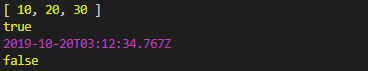

## 函数、闭包、递归、apply、call、bind、沙箱

### 函数中this的指向

- 普通函数中的this是谁?-----window
- 对象.方法中的this是谁?----当前的实例对象
- 定时器方法中的this是谁?----window
- 构造函数中的this是谁?-----实例对象
- 原型对象方法中的this是谁?---实例对象

### 函数的不同的调用方式

- 普通函数方式
```javascript
function f1() {
      console.log("我是普通函数");
    }
    f1();
```
- 构造函数---通过new来调用，创建对象
```javascript
function F1() {
      console.log("我是构造函数");
    }
    var f=new F1();
```
- 对象的方法
```javascript
 function Person() {
      this.play=function () {
        console.log("我是对象里的方法");
      };
    }
    var per=new Person();
    per.play();
  ```

### 函数也是对象

函数是对象，对象不一定是函数

```javascript
   function F1() {
   }

   console.dir(F1);

   console.dir(Math);//中有__proto__,但是没有prorotype
```
运行代码在控制台我们可以看到Function F1既有__proto__又有prototype，而对象Math只有__proto__，得出结论：

- 对象中有__proto__,函数中应该有prototype
- 如果一个东西里面有prototype，又有__proto__,说明是函数,也是对象

所有的函数实际上都是Function的构造函数创建出来的实例对象:
```javascript
   var f1=new Function("num1","num2","return num1+num2");
   console.log(f1(10,20));
   console.log(f1.__proto__==Function.prototype);
```
所以,函数实际上也是对象。

### 数组中的函数的调用

数组可以存储任何类型的数据包括函数。
```javascript
 var arr=[
        function () {
          console.log("十一假期快乐");
        },
        function () {
          console.log("十一假期开心");
        }
        ,
        function () {
          console.log("十一假期健康");
        }
        ,
        function () {
          console.log("十一假期安全");
        },
        function () {
          console.log("十一假期如意");
        }
    ];
     //回调函数:函数作为参数使用
    arr.forEach(function (ele) {
      ele();
    });

```

### apply和call方法的使用

apply和call的作用：可以改变this的指向

函数改变this指向
```javascript
 function f1(x,y) {
         console.log((x+y)+":===>"+this);
         return "这是函数的返回值";
       }
       //apply和call调用
       var r1=f1.apply(null,[1,2]);//此时f1中的this是window
       console.log(r1);
       var r2=f1.call(null,1,2);//此时f1中的this是window
       console.log(r2);
       console.log("=============>");
       //改变this的指向
       var obj={
         sex:"男"
       };
       //本来f1函数是window对象的,但是传入obj之后,f1函数此时就是obj对象的
       var r3=f1.apply(obj,[1,2]);//此时f1中的this是obj
       console.log(r3);
       var r4=f1.call(obj,1,2);//此时f1中的this是obj
       console.log(r4);
```

方法改变this的指向
```javascript
function Person(age) {
     this.age = age;
   }
   Person.prototype.sayHi = function (x, y) {
     console.log((x + y) + ":====>" + this.age);//是实例对象
   };

   function Student(age) {
     this.age = age;
   }
   var per = new Person(10);//实例对象
   var stu = new Student(100);//实例对象
   //sayHi方法是per实例对象的,通过调用apply和call将this指向stu对象，那么再输出age输出的是stu的年龄100
   per.sayHi.apply(stu, [10, 20]);//30:====>100
   per.sayHi.call(stu, 10, 20);//30:====>100
```

apply和call的使用方法
- apply的使用语法
   - 函数名字.apply(对象,[参数1,参数2,...]);
   - 方法名字.apply(对象,[参数1,参数2,...]);
- call的使用语法
   - 函数名字.call(对象,参数1,参数2,...);
   - 方法名字.call(对象,参数1,参数2,...);

作用:改变this的指向
apply、call不同的地方:参数传递的方式是不一样的
只要是想使用别的对象的方法,并且希望这个方法是当前对象的,那么就可以使用apply或者是call的方法改变this的指向
实例对象调用方法,方法要么在实例对象中存在,要么在原型对象中存在。
所有的函数都是Function的实例对象，apply和call方法实际上并不在函数这个实例对象中,而是在Function的prototype中

### bind方法
bind方法是复制的意思,参数可以在复制的时候传进去,也可以在复制之后调用的时候传入进去.
apply和call是调用的时候改变this指向
bind方法,是赋值一份的时候,改变了this的指向
```javascript
//方法调用bind
  function Person(age) {
      this.age=age;
    }
    Person.prototype.play=function () {
      console.log(this+"====>"+this.age);
    };

    function Student(age) {
      this.age=age;
    }
    var per=new Person(10);
    var stu=new Student(20);
    //复制了一份
    var ff=per.play.bind(stu);
    ff();//20
```
bind使用语法：
函数名字.bind(对象,参数1,参数2,...);---->返回值是复制之后的这个函数
方法名字.bind(对象,参数1,参数2,...);---->返回值是复制之后的这个方法
```javascript
//函数调用bind
    var ff=f1.bind(null);
       ff(10,20);//undefined   （window没有age属性）
//复制了一份的时候,把参数传入到了f1函数中,x===>10,y===>20,null就是this,默认就是window
   function Person() {
     this.age = 1000;
   }
   Person.prototype.eat = function () {
     console.log("这个是吃");
   };
   var per = new Person();

   var ff = f1.bind(per, 10, 20);
   ff();//30：====>1000（person的age为1000）
```

### 函数中几个成员
```javascript
 function f1(x,y) {
      console.log(f1.name);//f1
      console.log(f1.arguments.length);//2
      console.log(f1.length);//2
      console.log(f1.caller);//调用者 [Function: f2]
    }
    function f2() {
      console.log("f2函数的代码");
      f1(1,2);
    }
    f2();
```
函数中有一个name属性----->函数的名字,name属性是只读的,不能修改
函数中有一个arguments属性--->实参的个数
函数中有一个length属性---->函数定义的时候形参的个数
函数中有一个caller属性---->调用(f1函数在f2函数中调用的,所以,此时调用者就是f2)

### 高阶函数之函数作为返回值使用

```javascript
   function f1(fn) {
     console.log("f1的函数");
     fn();//此时fn当成是一个函数来使用的
   }
   //fn是参数,最后作为函数使用了,函数是可以作为参数使用
   //1.传入匿名函数
   f1(function () {
     console.log("我是匿名函数");
   });
   //2.传入命名函数
   function f2() {
     console.log("f2的函数");
   }
   f1(f2);
   //函数作为参数的时候,如果是命名函数,那么只传入命名函数的名字,没有括号
   //如果是f1(f2())代表把f2函数执行后的返回值当做参数，然而f2函数没有返回值。所以这样会报错
```

应用案例：
```javascript
   function f1(fn) {
     setInterval(function () {
       console.log("定时器开始");
       fn();
       console.log("定时器结束");
     },1000);
   }

   f1(function () {
     console.log("好困啊,好累啊,就是想睡觉");
   });
```
执行以上代码的结果是每隔一段时间便输出一次“好困啊,好累啊,就是想睡觉”。

### 高阶函数之函数作为返回值使用
```javascript
    function f1() {
         console.log("f1函数开始");
         return function () {
           console.log("我是函数,但是此时是作为返回值使用的");
         }
         console.log("f1函数结束");//这行不会执行，因为函数执行在遇到return就结束了。
       }
    
       var ff=f1();
       ff();
```
执行结果为：f1函数开始
          我是函数，但是此时是作为返回值使用的

### 判断某个对象的类型

**浅谈Object.prototype.toString.call()方法**
- 在JavaScript里使用typeof判断数据类型，只能区分基本类型。
   - 即：number、string、undefined、boolean、object。
- 对于null、array、function、object来说，使用typeof都会统一返回object字符串。
- 要想区分对象、数组、函数、单纯使用typeof是不行的。在JS中，可以通过Object.prototype.toString方法，判断某个对象之属于哪种内置类型。
- 分为null、string、boolean、number、undefined、array、function、object、date、math。

#### 判断基本类型
```javascript
Object.prototype.toString.call(null); // "[object Null]"
Object.prototype.toString.call(undefined); // "[object Undefined]"
Object.prototype.toString.call(“abc”);// "[object String]"
Object.prototype.toString.call(123);// "[object Number]"
Object.prototype.toString.call(true);// "[object Boolean]"
```

#### 判断原生引用类型
```javascript

//**函数类型**
Function fn(){
  console.log(“test”);
}
Object.prototype.toString.call(fn); // "[object Function]"

//**日期类型**
var date = new Date();
Object.prototype.toString.call(date); // "[object Date]"

//**数组类型**
var arr = [1,2,3];
Object.prototype.toString.call(arr); // "[object Array]"

//**正则表达式**
var reg = /[hbc]at/gi;
Object.prototype.toString.call(reg); // "[object RegExp]"

//**自定义类型**
function Person(name, age) {
    this.name = name;
    this.age = age;
}
var person = new Person("Rose", 18);
Object.prototype.toString.call(person); // "[object Object]"
//很明显这种方法不能准确判断person是Person类的实例，而只能用instanceof 操作符来进行判断，如下所示：

//判断某个对象是不是某个类型
console.log(person instanceof Person); // true
```
小案例====>封装一个判断这个对象和传入的类型是不是同一个类型的函数
```javascript
function getFuncType(type){
  return function(obj){
    console.log(obj);
    return Object.prototype.toString.call(obj) === type;
  }
}

var ff=getFuncType("[object Array]");
var result=ff([10,20,30]);
console.log(result);

var ff1=getFuncType("[object Object]");
var dt=new Date();
var result1=ff1(dt);
console.log(result1);
```
运行结果：


### 作用域和作用域链及预解析

- 变量---->局部变量和全局变量
- 作用域:就是变量的使用范围
    - 局部作用域和全局作用域
- js中没有块级作用域---一对括号中定义的变量,这个变量可以在大括号外面使用
- 函数中定义的变量是局部变量
- 作用域链:变量的使用,从里向外,层层的搜索,搜索到了就可以直接使用了
- 层层搜索,搜索到0级作用域的时候,如果还是没有找到这个变量,结果就是报错
- 预解析:就是在浏览器解析代码之前,把变量的声明和函数的声明提前(提升)到该作用域的最上面

### 闭包

闭包的概念:函数A中,有一个函数B,函数B中可以访问函数A中定义的变量或者是数据,此时形成了闭包(这句话暂时不严谨)
闭包的模式:函数模式的闭包,对象模式的闭包
闭包的作用:缓存数据,延长作用域链
闭包的优点和缺点:缓存数据,数据没有及时的释放
局部变量是在函数中,函数使用结束后,局部变量就会被自动的释放
如果想要缓存数据,就把这个数据放在外层的函数和里层的函数的中间位置
闭包后,里面的局部变量的使用作用域链就会被延长

- 函数模式的闭包：在一个函数中有一个函数
```javascript
   function f1() {
     var num=10;
     //函数的声明
     function f2() {
       console.log(num);
     }
     //函数调用
     f2();
   }
   f1();
```

- 对象模式的闭包：函数中有一个对象，这个对象能访问函数中的变量，就形成了闭包
```javascript
   function f3() {
     var num=10;
     var obj={
       age:num
     };
     console.log(obj.age);//10
   }
   f3();
```
### 普通函数与闭包比较

普通函数：
```javascript
 function f1() {
      var num = 10;
      num++;
      return num;
    }
    console.log(f1());//11
    console.log(f1());//11
    console.log(f1());//11

```
函数模式的闭包：
```javascript
function f2() {
      var num = 10;
      return function () {
        num++;
        return num;
      }
    }
    var ff = f2();
    console.log(ff());//11
    console.log(ff());//12
    console.log(ff());//13
```
### 沙箱
沙箱:环境,黑盒,在一个虚拟的环境中模拟真实世界,做实验,实验结果和真实世界的结果是一样,但是不会影响真实世界
```javascript
   var num=10;
   console.log(num+10);//20

   //沙箱---小环境
   (function () {
     var num=10;
     console.log(num);//10
   })();

   //沙箱---小环境
   (function () {
     var num=20;
     console.log(num+10);//30
   }());

```
```javascript
   var num=100;
   (function () {
     var num=10;//这个num与外面的num重名但是不影响外面的num
     console.log(num);//10
   }());


   console.log(num);//100
```

### 递归
递归:函数中调用函数自己,此时就是递归,递归一定要有结束的条件
```javascript
var i = 0;
    function f1() {
      i++;
      if (i < 5) {
        f1();
      }
      console.log("从前有个山,山里有个庙,庙里有个和尚给小和尚讲故事:");

    }

    f1();//输出了5遍：从前有个山,山里有个庙,庙里有个和尚给小和尚讲故事:
```
**递归实现：求n个数字的和  n=5--->  5+4+3+2+1**
```javascript
   // 函数的声明
   function getSum(x) {
     if(x==1){
       return 1;
     }
     return x+getSum(x-1);
   }
   //函数的调用
   console.log(getSum(5));
```

  
   执行过程:
   代码执行getSum(5)--->进入函数,此时的x是5,执是5+getSum(4),此时代码等待
   此时5+getSum(4),代码先不进行计算,先执行getSum(4),进入函数,执行的是4+getSum(3),等待, 先执行的是getSum(3),进入函数,执行3+getSum(2),等待,先执行getSum(2),进入函数,执行 2+getSum(1);等待, 先执行getSum(1),执行的是x==1的判断,return 1,所以,
    此时getSum(1)的结果是1,开始向外走出去
    2+getSum(1) 此时的结果是:2+1
    执行:
    getSum(2)---->2+1
    3+getSum(2) 此时的结果是3+2+1
    4+getSum(3) 此时的结果是4+3+2+1
    5+getSum(4) 此时的结果是5+4+3+2+1
  
    结果:15
  
  
  
    